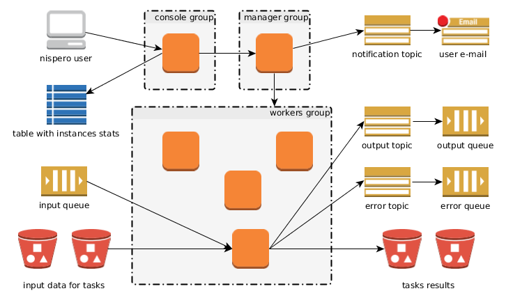

# Nispero architecture

## glossary

*Nispero* has a lot of components, resources and steps in life cycle, which means that things can get a bit confusing; here you can find a list with a brief description of all used names.

* *instructions* — application for solve tasks
* *manager* — monitoring and management system for *nispero*, instance that host this application as well
* *console* — web interface for *manager*, instance that host this application
* *worker* — application that run instructions on instances, instance that host this application
* *workers group* — auto scaling group with worker instances
* *input queue* — SQS queue for tasks
* *output topic* and *input topic* — topics for success and fails results
* *output* queue and error queue — queues for success and fails results
* *nisperoCLI* — *nispero* command line interface
* *nispero config* — configuration of *nispero*
