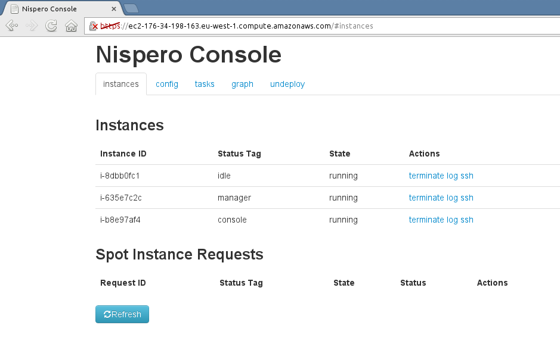

# Nispero Console

Console is part of *manager*, and it provides a graphic interface for controlling and managing *nispero*. It is hosted on a separate EC2 instance.

To get access to the console use the link in the notification e-mail that you will receive after its launch.

## instances

In this tab you can view a list of *workers* instances, view their status and terminate them. Also you can find here a command for connecting to them via ssh.

## config

This tab contains information about the *workers* auto scaling group. Also you can change here tje desired capacity of the group, i.e. change number of instances in *workers*.

## tasks

This tab allows you to add new tasks to the *input queue*, and view the results of (succesful and failed) tasks.

## graph

This tab contains graphic with history of *workers* state.

## undeploy

This is a developer tab, here you can view list of all auto scaling groups and launch configurations tagged with "nispero" tag.

